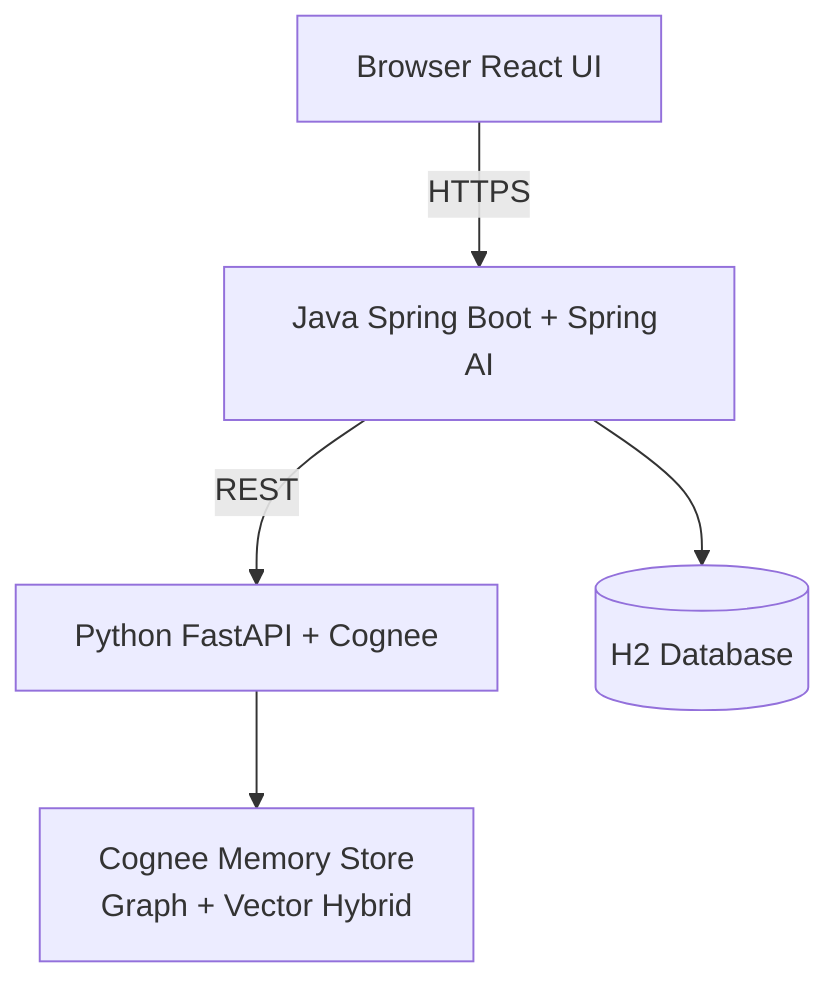

# OnceTold 🧠
### *Tell us once. We'll remember.*

> **Cognee Hangover Hackathon submission** — WeMakeDevs + Cognee

---

## The Problem

Every time a customer contacts support, they repeat themselves from scratch. No continuity exists between tickets - a returning customer with a known issue gets treated like a stranger.

## The Solution

OnceTold is a customer support chat app where every ticket is stored as memory in **Cognee** (a hybrid graph-vector AI memory layer). When a customer opens a new ticket, the system automatically recalls their relevant history. When a ticket is resolved, the conversation is consolidated into permanent memory. Old memory is eventually forgotten, keeping context useful instead of cluttered.

---

## Real World Example

> Sarah contacts support in March about a double billing charge. The issue gets resolved and the resolution is stored in Cognee's memory graph.
>
> In June, Sarah contacts support again about her account balance. **Without Sarah saying anything about March**, the bot immediately references her prior billing issue and the resolution - saving Sarah from repeating herself and helping the agent understand full context instantly.

---

## The Memory Loop *(judged criteria)*

| Step | Cognee Function | When it happens |
|------|----------------|-----------------|
| **Remember** | `cognee.remember()` | Every customer message -> stored in session memory |
| **Recall** | `cognee.recall()` | New ticket opened -> prior history recalled automatically |
| **Improve** | `cognee.improve()` | Ticket resolved -> raw chat consolidated into graph memory |
| **Forget** | `cognee.forget()` | Scheduled daily -> removes memory older than 90 days |

---

## Architecture



---

## Tech Stack

| Layer | Technology |
|-------|-----------|
| Backend | Java 21, Spring Boot 3.x, Spring Security + JWT |
| AI Orchestration | Spring AI (ChatClient) |
| Memory Engine | Python 3.11, FastAPI, Cognee 1.2.2 |
| LLM Provider | Groq (llama-3.3-70b) via OpenAI-compatible API |
| Embeddings | Gemini embedding-001 via Cognee |
| Database | H2 in-memory |
| Frontend | React (single-page, inline Babel) |

---

## Setup Instructions

### Prerequisites
- Java 21+
- Python 3.11+
- Groq API key (free at console.groq.com)
- Gemini API key (free at aistudio.google.com)

### 1. Clone the repo
```bash
git clone https://github.com/OM2412/OnceTold.git
cd OnceTold
```

### 2. Start the Java app
```bash
.
\mvnw.cmd spring-boot:run
```

### 3. Run the frontend
The UI is served from `src/main/resources/static/index.html` in this repo.

### 4. Start the memory service
Run the companion Python FastAPI service on `http://localhost:8000` if you want live memory recall and improvement features.

---

## Demo Flow

1. Register as **CUSTOMER** -> create a ticket about a billing issue
2. Chat with the AI bot -> it responds helpfully
3. Login as **AGENT** -> view ticket queue -> resolve the ticket with a summary
4. Login back as **CUSTOMER** -> open a **second ticket** about a related issue
5. The bot **references the prior billing context unprompted** - this is OnceTold working

---

## Cognee Integration Details

- `remember()` - called on every customer message, session-scoped to `customer_id`
- `recall()` - called when a ticket is opened, retrieves context from both session and graph
- `improve()` - called on ticket resolution with the agent's resolution summary
- `forget()` - scheduled daily, removes stale memory older than 90 days

---

## AI Disclosure

This project was built with assistance from AI coding tools (GitHub Copilot) as permitted by hackathon rules.

---

## Credits

- [Cognee](https://github.com/topoteretes/cognee) - hybrid graph-vector memory engine
- [Lucide React](https://lucide.dev) - UI icons (ISC license)
- [Groq](https://groq.com) - LLM inference (free tier)
- [Google Gemini](https://aistudio.google.com) - embeddings (free tier)
- [unDraw](https://undraw.co) - illustrations (free for commercial use)
